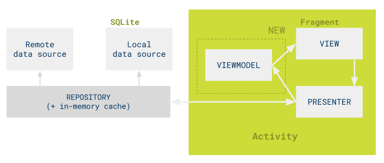

# TODO-DataBinding

It is based on the [todo-mvp](https://github.com/googlesamples/android-architecture/tree/todo-mvp/todoapp) sample and uses the Data Binding library to display data and bind UI elements to actions.

It doesn't follow a strict Model-View-ViewModel or a Model-View-Presenter
pattern, as it uses both View Models and Presenters.

The [Data Binding Library](http://developer.android.com/tools/data-binding/guide.html#data_objects) saves on boilerplate code allowing UI elements to be bound to a property in a
data model.

* Layout files are used to bind data to UI elements
* Events are also bound with an action handler
    * Data can be observed and set up to be updated automatically when needed

​	 


### Data binding

In the todo-mvp sample, a Task description is set in the [TaskDetailFragment](https://github.com/googlesamples/android-architecture/blob/todo-mvp/todoapp/app/src/main/java/com/example/android/architecture/blueprints/todoapp/taskdetail/TaskDetailFragment.java):


```java
public void onCreateView(...) {
    ...
    mDetailDescription = (TextView)
root.findViewById(R.id.task_detail_description);
}

@Override
public void showDescription(String description) {
    mDetailDescription.setVisibility(View.VISIBLE);
    mDetailDescription.setText(description);
}
```
In this sample, the [TaskDetailFragment](https://github.com/googlesamples/android-architecture/blob/todo-databinding/todoapp/app/src/main/java/com/example/android/architecture/blueprints/todoapp/taskdetail/TaskDetailFragment.java) simply passes the Task to the data binding:


```java
@Override
public void showTask(Task task) {
    mViewDataBinding.setTask(task);
}
```
and the library will take care of displaying it, as defined by the layout (<code>[taskdetail\_frag.xml](https://github.com/googlesamples/android-architecture/blob/todo-databinding/todoapp/app/src/main/res/layout/taskdetail_frag.xml)</code>)


```xml
<TextView
    android:id="@+id/task_detail_description"
    ...
    android:text="@{task.description}" />
```
### Event binding

Data binding eliminates the need to call <code>findViewById() </code>and event binding can also help minimizing <code>setOnClickListener()</code>.

In this CheckBox from <code>[taskdetail\_frag.xml](https://github.com/googlesamples/android-architecture/blob/todo-databinding/todoapp/app/src/main/res/layout/taskdetail_frag.xml)</code>, the presenter is called directly when the user taps on it:


```xml
<CheckBox
    android:id="@+id/task_detail_complete"
    ...
    android:checked="@{task.completed}"
    android:onCheckedChanged="@{(cb, isChecked) ->
    presenter.completeChanged(task, isChecked)}" />
```
### Observing data

The view that shows the list of tasks (TasksFragment) only needs to know if the
list is empty to show the appropriate message in that case. It uses [TasksViewModel](https://github.com/googlesamples/android-architecture/blob/todo-databinding/todoapp/app/src/main/java/com/example/android/architecture/blueprints/todoapp/tasks/TasksViewModel.java) to provide that information to the layout. When the list size is set, only the
relevant properties are notified and the UI elements bound to those properties
are updated.


```java
public void setTaskListSize(int taskListSize) {
    mTaskListSize = taskListSize;
    notifyPropertyChanged(BR.noTaskIconRes);
    notifyPropertyChanged(BR.noTasksLabel);
    notifyPropertyChanged(BR.currentFilteringLabel);
    notifyPropertyChanged(BR.notEmpty);
    notifyPropertyChanged(BR.tasksAddViewVisible);
}
```
## Feature components

There are multiple ways to create the relevant parts of a feature using the
Data Binding Library. In this case, the responsibility of each component in
this sample is:

* Activity: object creation
* Fragment: interaction with framework components (options menu, Snackbar, FAB,
    Adapter for list…)
    * Presenter: receives user actions and retrieves the data from the repository. If
      it doesn't do data loading, it's calling an action handler (See [TasksItemActionHandler](https://github.com/googlesamples/android-architecture/blob/todo-databinding/todoapp/app/src/main/java/com/example/android/architecture/blueprints/todoapp/tasks/TasksItemActionHandler.java))
    * ViewModel: Exposes data for a particular view

Some features don't have a ViewModel ([TaskDetail](https://github.com/googlesamples/android-architecture/blob/todo-databinding/todoapp/app/src/main/java/com/example/android/architecture/blueprints/todoapp/taskdetail), [AddEditTask](https://github.com/googlesamples/android-architecture/blob/todo-databinding/todoapp/app/src/main/java/com/example/android/architecture/blueprints/todoapp/addedittask)) as they use the Task model directly.

## Additional dependencies

Data Binding Library.

## Features

### Testability

#### Unit testing

As the Data Binding Library takes care of many of the wiring that would usually
be unit tested, the number of unit tests is lower although the  test coverage
should be similar.

#### UI testing

No difference with MVP.

### Code metrics

Compared to MVP, there are more Java classes but less code per class. Because
some wiring is moved to layouts, there are more XML lines.


```
-------------------------------------------------------------------------------
Language                     files          blank        comment           code
-------------------------------------------------------------------------------
Java                            50           1079           1552           3327 (3450 in MVP)
XML                             34            122            337            714
-------------------------------------------------------------------------------
SUM:                            84           1201           1889           4041
-------------------------------------------------------------------------------
```
### Maintainability

#### Ease of amending or adding a feature

Easier than MVP for small changes. A new feature might require some experience
with the library.

#### Learning cost

The Data Binding library takes care of the communication between some
components, so developers need to understand what it does and doesn't before
making changes to the code.

